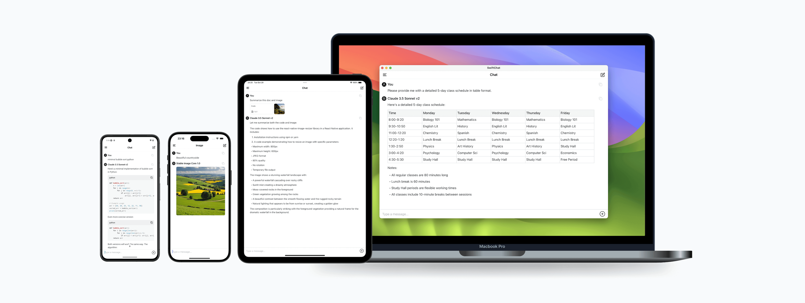

[中文](/README_CN.md)

# SwiftChat - A Cross-platform AI Chat App

SwiftChat is a fast and responsive AI chat application built with React Native and powered by Amazon Bedrock. Featuring
a minimalist design philosophy and strong privacy protection, it offers real-time streaming conversations and AI image
generation across Android, iOS, and macOS platforms.



**Key Features:**

- Real-time streaming chat with AI
- AI image generation
- Cross-platform support (Android, iOS, macOS)
- Tablet-optimized for iPad and Android tablets
- Fast launch and responsive performance
- Multiple AI model support and switching
- Built with React Native
- Powered by Amazon Bedrock

## Architecture


By default, we use AWS App Runner, which is commonly used to host Python FastAPI servers, offering high performance,
scalability and low latency.

Alternatively, we provide the option to replace App Runner with AWS Lambda using Function URL for a more cost-effective
solution, as shown in
this [example](https://github.com/awslabs/aws-lambda-web-adapter/tree/main/examples/fastapi-response-streaming).

## Getting Started

### Step 1: Set up your API Key

1. Right-click [Parameter Store](https://console.aws.amazon.com/systems-manager/parameters/) to open your AWS Console in
   new window.
2. Check whether you are in the [supported region](#supported-region), then click on the "Create parameter" button.
3. Name: Enter a descriptive name for your parameter (e.g., "SwiftChatAPIKey", this is `ApiKeyParam` you will fill
   in [Step2](#step-2-deploy-stack-and-get-your-api-url)).
4. Tier: Select **Standard**.
5. Type: Select **SecureString**.
6. Value: Any string without spaces (This is the API Key you'll need to configure your App
   in [Step 3](#step-3-download-the-app-and-setup-with-api-url-and-api-key)).
7. Click "Create parameter".

### Step 2: Deploy stack and get your API URL

1. Click the following button to launch the CloudFormation Stack in the same region with your API Key just created.
    - App Runner

      [](https://console.aws.amazon.com/cloudformation/home#/stacks/create/template?stackName=SwiftChatAPI&templateURL=https://aws-gcr-solutions.s3.amazonaws.com/swift-chat/latest/SwiftChatAppRunner.template)

    - Lambda (Requires manual setup of Function URL with NONE auth)

      [](https://console.aws.amazon.com/cloudformation/home#/stacks/create/template?stackName=SwiftChatAPI&templateURL=https://aws-gcr-solutions.s3.amazonaws.com/swift-chat/latest/SwiftChatLambda.template)

2. Click **Next**, On the "Specify stack details" page, provide the following information:
    - Fill the `ApiKeyParam` with the parameter name you used for storing the API key (e.g., "SwiftChatAPIKey").
    - For App Runner, choose an `InstanceTypeParam` based on your needs.
3. Click **Next**, Keep the "Configure stack options" page as default, Read the Capabilities and Check the "I
   acknowledge that AWS CloudFormation might create IAM resources" checkbox at the bottom.
4. Click **Next**, In the "Review and create" Review your configuration and click **Submit**.

Wait about 3-5 minutes for the deployment to finish, and get your API URL:

**For App Runner**, click the CloudFormation stack and go to **Outputs** tab, you can find the **API URL**
(which looks like `https://xxx.xxx.awsapprunner.com`)

**For Lambda**, follow these steps to get your **API URL**:

1. Find your Lambda function in CloudFormation -> **Resources** -> APIHandler
2. Click to open the Lambda function (`SwiftChatLambda-xxx`)
3. Set up Function URL:
    - Go to **Configuration** -> **Function URL**, Click **Create function URL**
    - Select: **Auth type**: `NONE`
    - Enable: **Invoke mode**: `RESPONSE_STREAM` under Additional settings
4. Click Save to get your API URL (`https://xxx.lambda-url.xxx.on.aws`)
5. Note: We use Bearer Token for API security verification. You can upgrade to `AWS_IAM` Auth type manually.

### Step 3: Download the app and setup with API URL and API Key

1. Download the App
    - Android App click to [Download](https://github.com/aws-samples/swift-chat/releases/download/v1.5.0/SwiftChat.apk)
    - macOS App click to [Download](https://github.com/aws-samples/swift-chat/releases/download/v1.5.0/SwiftChat.dmg)
    - iOS (Currently we do not provide the iOS version, you can build it locally with Xcode)

2. Launch your App, click the left menu button to open the drawer page, click **Settings** in the bottom of the drawer.
3. Paste the `API URL` and `API Key` then select the Region.
4. You can change the default text and image model, and **make sure these models are enabled in the corresponding Region
   in the AWS Console**.
5. Click the top right finish icon to save your configuration and start your chat.

Congratulations 🎉 Your SwiftChat App is ready to use!

### Supported Region

- US East (N. Virginia): us-east-1
- US West (Oregon): us-west-2
- Asia Pacific (Mumbai): ap-south-1
- Asia Pacific (Singapore): ap-southeast-1
- Asia Pacific (Sydney): ap-southeast-2
- Asia Pacific (Tokyo): ap-northeast-1
- Canada (Central): ca-central-1
- Europe (Frankfurt): eu-central-1
- Europe (London): eu-west-2
- Europe (Paris): eu-west-3
- South America (São Paulo): sa-east-1

## What Makes SwiftChat Really "Swift"?

🚀 **Fast Launch Speed**

- Thanks to the **AOT** (Ahead of Time) compilation of RN Hermes engine
- Added **lazy loading** of complex components
- App can start and be ready for input **within 1 second**

🌐 **Fast Request Speed**

- Speed up end-to-end API requests through **image compression**
- Deploying APIs in the **same region** as Bedrock provides lower latency
- Minimal response payload with **zero parsing** needed for direct display

📱 **Fast Render Speed**

- Using `useMemo` and custom caching to creates secondary cache for session content
- Reduce unnecessary re-renders and speed up streaming messages display
- All UI components are rendered as **native components**

📦 **Fast Storage Speed**

- By using **react-native-mmkv** Messages can be read, stored, and updated **10x faster** than AsyncStorage
- Optimized session content and session list storage structure to accelerates history list display

## App Privacy & Security

- Encrypted API key storage
- Minimal permission requirements
- Local data storage only
- No user behavior tracking
- No data collection
- Privacy-first approach

## Build and development

Firstly, clone this repo and run `npm i` to download the dependencies.

### Build for Android

```bash
npm run start && npm run android
```

### Build for iOS

```bash
npm run start && npm run ios
```

### Build for macOS

1. Modify as `isMac = true` in `/src/App.tsx` and execute `npm run start`.
2. Double click `ios/SwiftChat.xcworkspace` to open the project in your Xcode.
3. Change the build destination to `My Mac (Mac Catalyst)` then click the ▶ Run button.

## Security

See [CONTRIBUTING](CONTRIBUTING.md#security-issue-notifications) for more information.

## License

This library is licensed under the MIT-0 License. See the LICENSE file.

