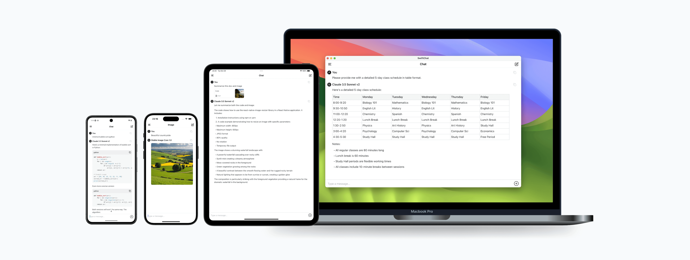

[English](/README.md)

# SwiftChat - 跨平台 AI 聊天应用

SwiftChat是一个使用 [React Native](https://reactnative.dev/) 构建并由 [Amazon Bedrock](https://aws.amazon.com/bedrock/)
提供支持的快速响应式AI聊天应用。它采用极简设计理念和强大的隐私保护，提供实时流式对话和AI图像生成功能，支持 Android、iOS 和
macOS 等多个平台。



**主要特点:**

- 与 AI 进行实时流式聊天
- 带进度的 AI 图像生成
- 多模态支持（相机拍照、图片选择和文档上传）
- 对话历史记录列表查看和管理
- 跨平台支持（Android、iOS、macOS）
- 针对 iPad 和 Android 平板电脑优化
- 快速启动和响应性能
- 支持多种 AI 模型及切换

## 架构


默认情况下，我们使用 AWS App Runner（通常用于托管 Python FastAPI 服务器），提供高性能、可扩展性和低延迟。

另外，我们提供使用 AWS Lambda 的 Function URL 替代 App Runner
的选项，以获得更具成本效益的解决方案，如 [示例](https://github.com/awslabs/aws-lambda-web-adapter/tree/main/examples/fastapi-response-streaming)
所示。

## 入门指南

### 第1步: 设置API Key

1. 右键点击 [Parameter Store](https://console.aws.amazon.com/systems-manager/parameters/) 在新窗口中打开AWS控制台。
2. 检查您是否在 [支持的区域](#支持的区域)，然后点击"创建参数"按钮。
3. 名称:为您的参数输入描述性名称(例如"SwiftChatAPIKey"，这是您将在 [第2步](#第2步-部署堆栈并获取api-url)
   中填写的`ApiKeyParam`)。
4. 层级:选择 **标准**。
5. 类型:选择 **SecureString**。
6. 值:任何不含空格的字符串（这是您需要在 [第3步](#第3步-下载应用并设置-api-url-和-api-key) 中配置 App 的 API Key）。
7. 点击"创建参数"。

### 第2步: 部署堆栈并获取API URL

1. 点击以下按钮在与刚才创建的 API Key 相同的区域启动 CloudFormation 堆栈。
    - App Runner

      [](https://console.aws.amazon.com/cloudformation/home#/stacks/create/template?stackName=SwiftChatAPI&templateURL=https://aws-gcr-solutions.s3.amazonaws.com/swift-chat/latest/SwiftChatAppRunner.template)

    - Lambda (需要手动设置无认证的 Function URL)

      [](https://console.aws.amazon.com/cloudformation/home#/stacks/create/template?stackName=SwiftChatLambda&templateURL=https://aws-gcr-solutions.s3.amazonaws.com/swift-chat/latest/SwiftChatLambda.template)

2. 点击**下一步**，在"指定堆栈详细信息"页面中提供以下信息:
    - 使用存储 API Key 的参数名填写`ApiKeyParam`(例如"SwiftChatAPIKey")。
    - 对于App Runner，根据您的需求选择`InstanceTypeParam`。
3. 点击**下一步**，保持"配置堆栈选项"页面默认设置，阅读功能并勾选底部的"我确认，AWS CloudFormation可能会创建 IAM 资源"复选框。
4. 点击**下一步**，在"审核并创建"中检查配置并点击**提交**。

等待约3-5分钟部署完成，然后获取 API URL:

**对于使用 App Runner**，点击CloudFormation堆栈并转到**输出**选项卡，您可以找到**API URL**(
类似`https://xxx.xxx.awsapprunner.com`)

**对于使用 Lambda**，按照以下步骤获取**API URL**:

1. 在 CloudFormation -> **资源** -> APIHandler中找到您的Lambda函数
2. 点击打开 Lambda 函数(`SwiftChatLambda-xxx`)
3. 设置 Function URL:
    - 转到 **配置** -> **函数 URL**，点击**创建函数 URL**
    - 选择: **授权类型**: `NONE`
    - 启用: **调用模式**: 在其他设置下选择`RESPONSE_STREAM`
4. 点击保存获取API URL(`https://xxx.lambda-url.xxx.on.aws`)
5. 注意: 我们默认使用 Bearer Token 进行 API 安全验证。您可以手动升级到`AWS_IAM`认证类型。

### 第3步: 下载应用并设置 API URL 和 API Key

1. 下载应用
    - Android 应用点击 [下载](https://github.com/aws-samples/swift-chat/releases/download/v1.5.0/SwiftChat.apk)
    - macOS 应用点击 [下载](https://github.com/aws-samples/swift-chat/releases/download/v1.5.0/SwiftChat.dmg)
    - iOS (目前不提供 iOS 版本，您可以使用 Xcode 在本地构建)

2. 启动应用，点击左侧菜单按钮打开抽屉页面，点击抽屉底部的**Settings**。
3. 粘贴`API URL`和`API Key`然后选择 Region。
4. 您可以更改默认的文本和图像模型，并**确保已在 AWS 控制台的对应 Region 中启用了这些模型**。
5. 点击右上角对勾图标保存配置并开始聊天。

恭喜🎉 您的 SwiftChat 应用已准备就绪!

### 支持的区域

- 美国东部(弗吉尼亚北部):us-east-1
- 美国西部(俄勒冈):us-west-2
- 亚太地区(孟买):ap-south-1
- 亚太地区(新加坡):ap-southeast-1
- 亚太地区(悉尼):ap-southeast-2
- 亚太地区(东京):ap-northeast-1
- 加拿大(中部):ca-central-1
- 欧洲(法兰克福):eu-central-1
- 欧洲(伦敦):eu-west-2
- 欧洲(巴黎):eu-west-3
- 南美洲(圣保罗):sa-east-1

## 是什么让SwiftChat如此"迅速"?

🚀 **快速启动速度**

- 得益于RN Hermes 引擎的 **AOT**（提前编译）
- 添加复杂组件的 **延迟加载**
- 应用可以在 **1秒内** 启动并准备好接收输入

🌐 **快速请求速度**

- 通过**图像压缩**加速端到端 API 请求
- 在与 Bedrock **相同区域**部署 API 以提供更低延迟
- 最小响应有效负载，**零解析**直接显示

📱 **快速渲染速度**

- 使用`useMemo`和自定义缓存为会话内容创建二级缓存
- 减少不必要的重新渲染并加快流式消息显示
- 所有 UI 组件都渲染为**原生组件**

📦 **快速存储速度**

- 通过使用 **react-native-mmkv** 消息可以比 AsyncStorage **快10倍**读取、存储和更新
- 优化会话内容和会话列表存储结构以加快历史记录列表显示

## 应用隐私和安全

- 加密 API Key 的存储
- 最小权限要求
- 仅本地数据存储
- 无用户行为跟踪
- 无数据收集
- 隐私优先策略

## 构建和开发

首先，克隆此仓库并运行`npm i`下载依赖项。

### 构建 Android

```bash
npm start && npm run android
```

## 构建 iOS

```bash
npm start && npm run ios
```

### 构建 macOS

1. 在 `/src/App.tsx` 中将 `isMac` 修改为 `true` 并执行 `npm start`。
2. 双击 `ios/SwiftChat.xcworkspace` 在 Xcode 中打开项目。
3. 将构建目标更改为 `My Mac (Mac Catalyst)` 然后点击 ▶ 运行按钮。

## 安全

更多信息请参见 [CONTRIBUTING](CONTRIBUTING.md#security-issue-notifications)。

## 许可证

该库使用 MIT-0 许可证。详见 [LICENSE](/LICENSE) 文件。
